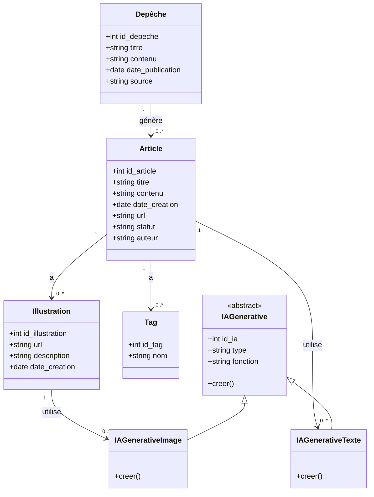
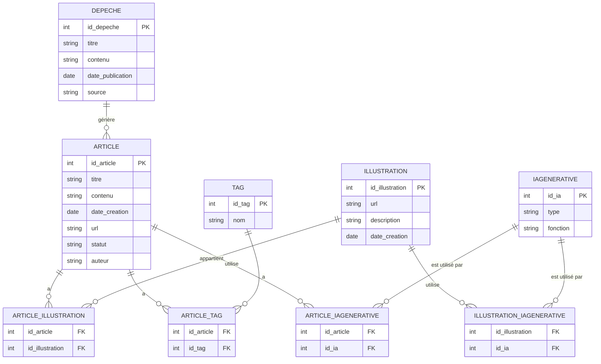
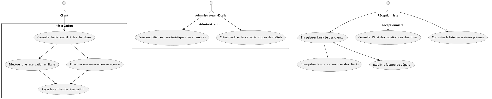
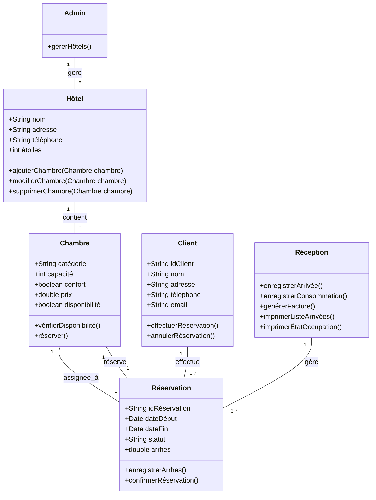
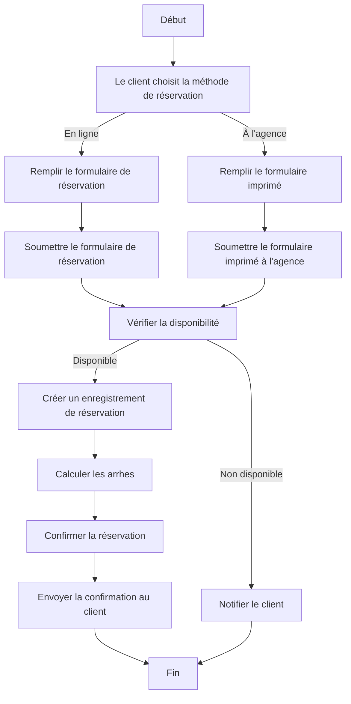
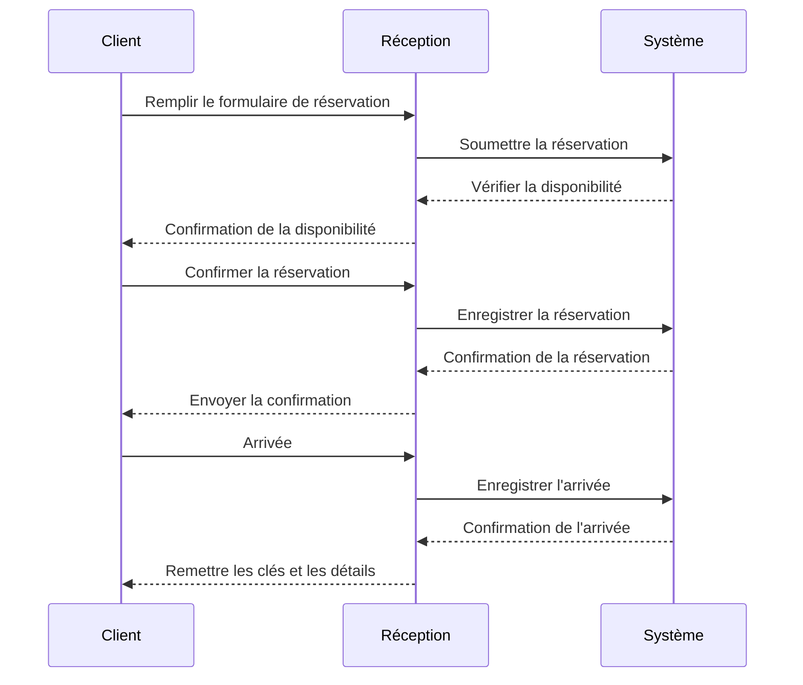

# Project ORM

## Question

1- lister les données nécessaires

    - Données pour les dépêches AFP :
         Identifiant de la dépêche
         Titre de la dépêche
         Contenu de la dépêche
         Date de publication de la dépêche
         Source de la dépêche
         
    - Données pour les articles générés :
    
         Identifiant de l'article
         Titre de l'article
         Contenu de l'article
         Date de création de l'article
         URL de l'article
         Statut de publication de l'article (brouillon, publié)
         Auteur de l'article (IA générative)

         
     - Données pour les illustrations :
     
         Identifiant de l'illustration
         URL de l'illustration
         Description de l'illustration
         Date de création de l'illustration
         Données pour les tags :
         Identifiant du tag
         Nom du tag
         
    - Données pour l'IA générative :
        Identifiant de l'IA générative
        Type de l'IA générative (texte ou image)
        Fonction de l'IA générative
        
    - Relations entre les entités :
    
        Une dépêche AFP peut générer plusieurs articles.
        Un article peut avoir plusieurs illustrations.
        Un article peut avoir plusieurs tags.
        Un article utilise une IA générative pour le texte.
        Une illustration utilise une IA générative pour l'image.

2- Créer le diagramme de classe UML

3- Créer le diagramme MCD 

4- Créer le schéma relationnel des tables grâce à un ORM dans le langage de
votre choix

J'ai utilisé le framework symfony avec l'ORM DOCTRINE  ,le code se trouve ci dessus. 

 
 

#
#
# Projet Hotel Management 

## Use Case Diagram

## Diagramme d'Activité

## Diagramme d'Activité

## Diagramme de sequence

